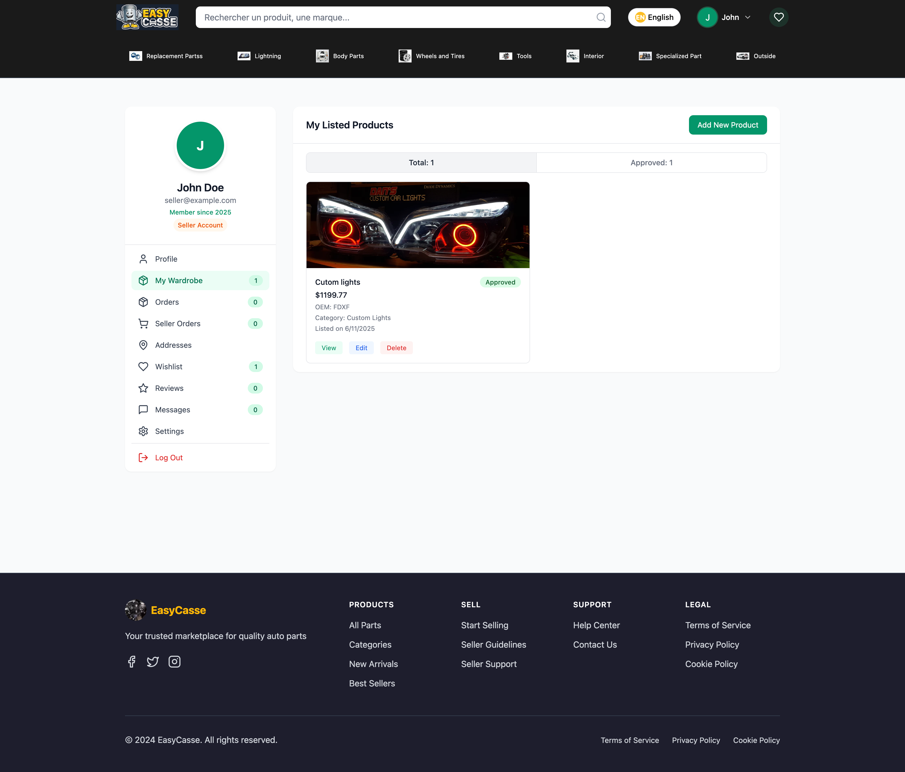

# AutoMart - Multivendor Car Parts Ecommerce Platform (MERN Stack)


## Overview

**AutoMart** is a modern **Multivendor Car Parts Ecommerce Platform** built with the **MERN stack (MongoDB, Express.js, React, Node.js)** and styled with **Tailwind CSS**. The platform enables multiple sellers to list automotive parts and customers to shop, track orders, and make secure purchases—all in one responsive solution.

---

## Features

### 🚗 For Customers
- 🔍 Browse car parts by category, brand, and vehicle
- 🛒 Add to cart, wishlist, and checkout with secure payments
- 📱 Fully responsive UI across devices
- 🔔 Real-time order status and notifications

### 🧰 For Vendors
- 📦 Product management dashboard
- 📊 Sales analytics and inventory control
- 📋 Order tracking and customer feedback
- 🎯 Profile and store customization

### 🛡️ For Admins
- 👥 Vendor registration approval
- 📈 Platform-wide sales monitoring
- 💰 Commission management and reporting
- 🛠️ System settings and role management

---

## Tech Stack

- **Frontend**: React 18, TypeScript, Tailwind CSS
- **Backend**: Node.js, Express.js
- **Database**: MongoDB (Mongoose)
- **Authentication**: JSON Web Tokens (JWT)
- **State Management**: React Context API
- **Routing**: React Router v6
- **Animations**: Framer Motion
- **Icons**: Lucide React

---

## Screenshots

### Customer Interface

#### Home Page


#### Product Listing


#### Product Details Page


#### Make an Offer Feature


#### Search and Filtering


### Vendor Dashboard

#### Overview


#### Dashboard


#### Products


#### Orders


#### Analytics


---

## Getting Started

### Prerequisites
- Node.js 18+
- MongoDB installed or Atlas account
- npm or yarn

### Installation

1. **Clone the repository**
```bash
git clone hhttps://github.com/zetaver/Multivendor-Car-Parts-Ecommerce-Platform.git
cd Multivendor-Car-Parts-Ecommerce-Platform
